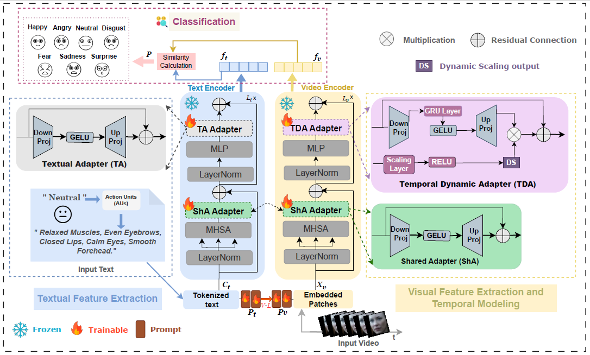
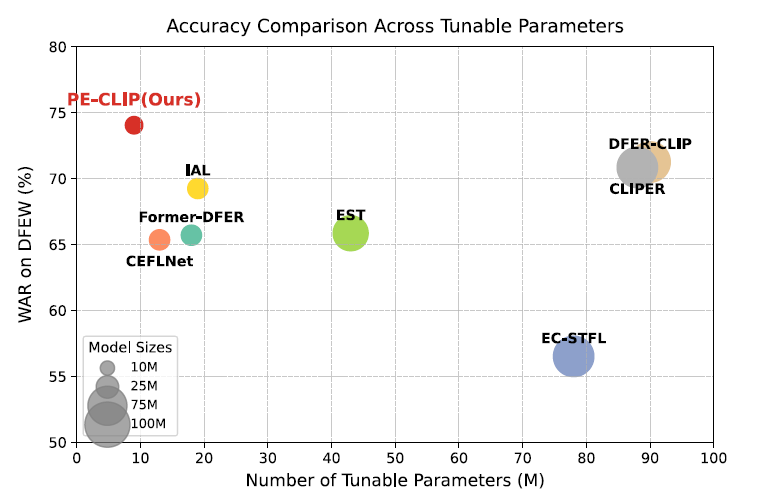

# PE-CLIP: A Parameter-Efficient Fine-Tuning of Vision-Language Models for Dynamic Facial Expression Recognition

Official PyTorch implementation of the ACM TOMM 2026 paper:

**PE-CLIP: A Parameter-Efficient Fine-Tuning of Vision-Language Models for Dynamic Facial Expression Recognition** <p align="center">
  <a href="https://dl.acm.org/doi/abs/10.1145/3786789">📄 Paper</a>
</p>

<p align="center">
  
</p>

## 📖 Overview

Dynamic Facial Expression Recognition (DFER) remains challenging due to subtle temporal variations, limited training data, and the computational cost of adapting large Vision-Language Models (VLMs). PE-CLIP is a parameter-efficient framework that adapts CLIP for DFER using lightweight adapters and multi-modal prompt learning. The proposed framework introduces a Temporal Dynamic Adapter (TDA), a Shared Adapter (ShA), and AU-guided prompt learning to improve visual-language alignment while requiring only a small fraction of trainable parameters.

---

## ✨ Highlights

- 🎯 Parameter-efficient adaptation of CLIP for Dynamic Facial Expression Recognition (DFER).
- ⏳ Temporal Dynamic Adapter (TDA) for effective temporal modeling.
- 🔄 Shared Adapter (ShA) for efficient visual-textual feature refinement.
- 🧠 Multi-modal Prompt Learning (MaPLe) with AU-guided textual descriptions.
- ⚡ Less than **6% trainable parameters** while maintaining competitive performance.
- 📊 Extensive evaluation on **DFEW**, **FERV39K**, and **AFEW** benchmarks.

---

## 📊 Main Results

| Dataset | UAR (%) | WAR (%) |
|----------|----------|----------|
| DFEW | 62.82 | 74.04 |
| FERV39K | 41.57 | 51.26 |
| AFEW | 53.85 | 58.49 |

<p align="center">
  
</p>

---

## 📂 Repository Structure

```text
PE-CLIP
│
├── annotation/           # Dataset annotations
├── dataloader/           # Data loading utilities
├── models/               # PE-CLIP architecture
├── figures/              # README figures
│
├── FERPAmainmxp.py       # Training/testing script (DFEW/FERV39K)
├── FERPAmainmxp_AFEW.py  # Training/testing script (AFEW)
├── fmix.py               # FMix augmentation
├── attentionmap.py       # Explainability and attention visualization
└── tsne_visualization.py # Feature embedding visualization
```

---

## 🛠 Requirements

Install dependencies using:

```bash
pip install -r requirements.txt
```

Main dependencies:

- PyTorch
- Torchvision
- timm
- einops
- NumPy
- scikit-learn
- matplotlib
- tqdm
- thop

---

## 🚀 Training and Evaluation

### DFEW / FERV39K

```bash
python FERPAmainmxp.py
```

### AFEW

```bash
python FERPAmainmxp_AFEW.py
```

Please update the dataset paths according to your local environment before running the scripts.

---

## 🔍 Visualization

### Attention Maps

```bash
python attentionmap.py
```
Generates attention maps, attention rollout, and gradient attention rollout visualizations for model interpretability.

### t-SNE Feature Visualization

```bash
python "tsne_visualization.py"
```
Visualizes learned feature embeddings using t-SNE.

---

## 📚 Citation

```bibtex
@article{saadi2026peclip,
  title={PE-CLIP: A Parameter-Efficient Fine-Tuning of Vision-Language Models for Dynamic Facial Expression Recognition},
  author={Saadi, Ibtissam and Hadid, Abdenour and Cunningham, Douglas W. and Taleb-Ahmed, Abdelmalik and El Hillali, Yassin},
  journal={ACM Transactions on Multimedia Computing, Communications and Applications},
  year={2026}
}
```
---

## 🙏 Acknowledgements

This work builds upon the excellent open-source projects [DFER-CLIP](https://github.com/zengqunzhao/DFER-CLIP), [CLIP](https://github.com/openai/CLIP), and [MaPLe](https://github.com/muzairkhattak/multimodal-prompt-learning). We sincerely thank the authors for making their code publicly available.

If you find this repository useful, please consider giving it a ⭐.
